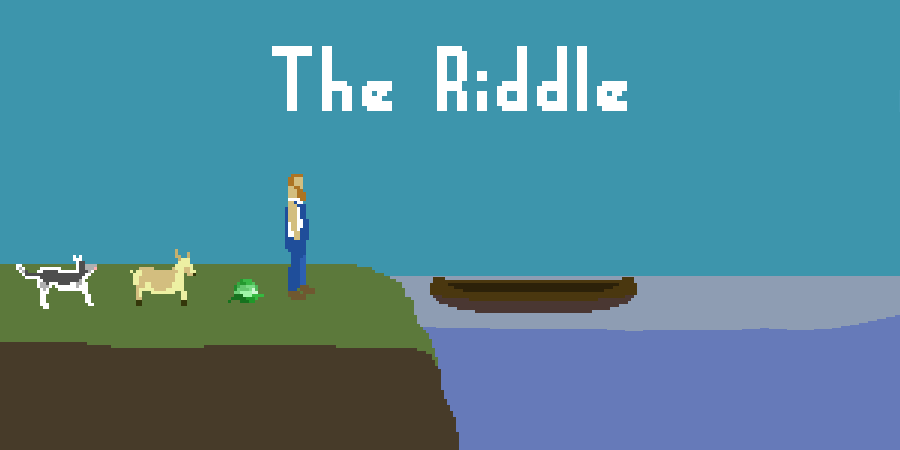

# Wolf, Goat, Cabbage #
A short game based on the classical riddle.

The farmer must cross the river with his wolf, goat, and cabbage. The boat only has room
for the farmer and one other. If left unattended, the wolf will eat the goat, and the goat will
eat the cabbage.

Made with the [Phaser](http://phaser.io) framework